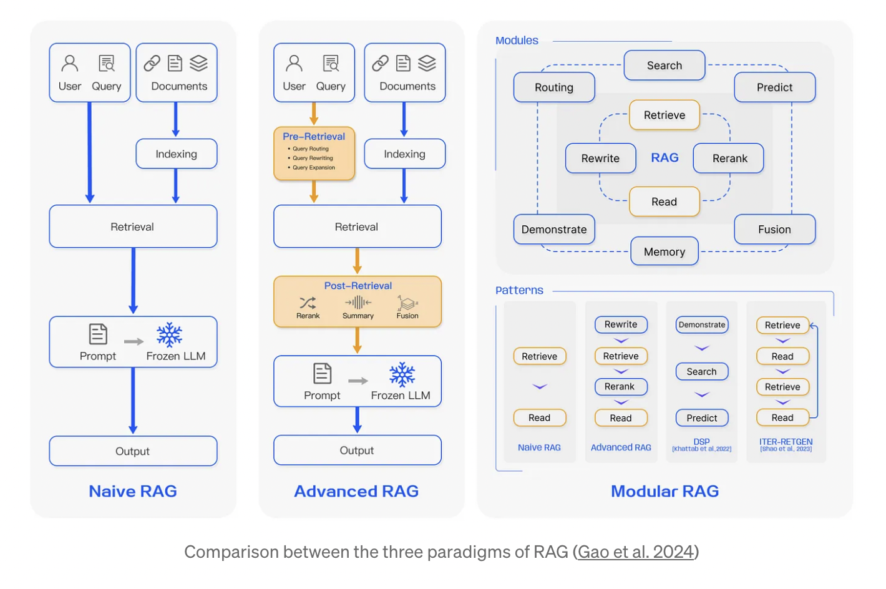

## 为何要搭建专属知识库？

搭建专属知识库的原因在于：利用大规模语言模型（LLM）来解锁存储在特定知识库中的信息。尽管 LLM 在处理一般语言和公开可用数据方面表现出色，但它们在**处理组织内部知识时存在局限性**。搭建专属知识库可以解决以下问题：

1.  **内部知识的价值**：每个组织都拥有其独特的内部知识库，其中包含对组织非常有价值的信息。通过搭建专属知识库，人们可以利用 LLMs 来访问和利用这些宝贵的内部知识。
2.  **提高工作效率**：专属知识库可以有效地组织和管理组织内部的知识和信息资源，使其更易于访问和利用。员工可以通过知识库快速查找和获取所需的信息，提高工作效率和准确性。
3.  **安全和访问控制**：专属知识库可以实现对信息的访问控制，确保只有经授权的用户可以查询和获取特定的知识。这对于需要保护机密信息或限制特定用户访问的情况非常重要。
4.  **可验证性和可靠性**：通过搭建专属知识库，可以确保 LLMs 生成的答案基于特定知识库的信息，从而使答案更具可验证性和可靠性。相比之下，仅仅通过对 LLMs 进行微调（fine-tuning）的方法可能无法提供相同的可验证性。
5.  **成本效益**：搭建专属知识库可以在一定程度上降低成本。相比于对 LLMs 进行持续运行和维护，搭建专属知识库可能更加经济实惠。
6.  **及时更新**：专属知识库使组织能够及时更新和管理其知识源。由于组织内部知识的不断演进和变化，通过专属知识库可以轻松更新和替换旧的知识内容，确保知识库中的信息始终是最新的。
7.  **多源集成**：专属知识库可以集成多个知识源，包括内部知识、外部数据和第三方信息源。这意味着组织可以从多个来源获取知识，并将其整合到一个集中的知识库中。当知识源发生变化时，可以方便地更新和同步这些源，确保知识库的完整性和准确性。
8.  **知识审核和校对**：专属知识库可以提供一个审核和校对机制，以确保更新的知识源的质量和准确性。组织可以对新的知识源进行审核和验证，并通过知识库的管理工具进行校对和修正，以确保知识的一致性和可靠性。
9.  **减少重复工作**：通过专属知识库，组织可以收集、整理和分享已有的知识和经验，避免重复工作。员工可以在知识库中搜索和查找已有的解决方案和最佳实践，从而节省时间和精力，避免重复劳动。
10.  **智能化决策支持**：专属知识库可以与智能化决策支持系统集成，为组织的决策制定过程提供数据和见解。通过将知识库中的信息与分析工具和算法结合起来，可以实现更准确、更有洞察力的决策支持。
11. **知识共享和传承**：专属知识库可以作为一个集中的平台，促进知识的共享和传承。组织成员可以将他们的专业知识和经验记录在知识库中，供其他人学习和借鉴。这有助于建立组织内部的知识共享文化，提高整体的知识水平和创新能力。

综上所述，搭建专属知识库使人们能够更好地利用 LLM，解锁和利用存储在组织内部知识库中的信息，从而满足安全性、可验证性、可扩展性和可靠性的需求，并在一定程度上降低成本、减少重复工作、改善决策质量、促进知识共享与传承等。

此外，随着 RAG 在数据应用领域不断拓展新的领域，凭借其卓越的洞察力和前期的提升，RAG 有望成为企业数据和人工智能的价值倍增器。然而，与任何先进技术一样，要取得成果，RAG 需要进行刻苦的基础工作。因此，尽早涉足 RAG 系统的探索，可以帮助企业和个人为未来竞争中占得先机。

## 什么是检索增强生成？

检索增强生成（RAG）是指对大型语言模型输出进行优化，使其能够在生成响应之前引用训练数据来源之外的权威知识库。大型语言模型（LLM）用海量数据进行训练，使用数十亿个参数为回答问题、翻译语言和完成句子等任务生成原始输出。在 LLM 本就强大的功能基础上，RAG 将其扩展为能访问特定领域或组织的内部知识库，所有这些都无需重新训练模型。这是一种经济高效地改进 LLM 输出的方法，让它在各种情境下都能保持相关性、准确性和实用性。

## 检索增强生成（RAG）的历史

该技术的根源至少可以追溯到 20 世纪 70 年代初。就在那时，信息检索研究人员制作了他们所谓的问答系统原型，即使用自然语言处理（NLP）来访问文本的应用程序，最初是在棒球等狭窄主题中。

多年来，这种文本挖掘背后的概念一直相当稳定。但驱动它们的机器学习引擎已经显着增长，提高了它们的实用性和受欢迎程度。如今，LLM 正在将问答系统提升到一个全新的水平。

## 为什么检索增强生成很重要？

LLM 是一项关键的人工智能（AI）技术，为智能聊天机器人和其他自然语言处理（NLP）应用程序提供支持。目标是通过交叉引用权威知识来源，创建能够在各种环境中回答用户问题的机器人。不幸的是，LLM 技术的本质在 LLM 响应中引入了不可预测性。此外，LLM 训练数据是静态的，并引入了其所掌握知识的截止日期。

LLM 面临的已知挑战包括：

- 在没有答案的情况下提供虚假信息。
- 当用户需要特定的当前响应时，提供过时或通用的信息。
- 从非权威来源创建响应。
- 由于术语混淆，不同的培训来源使用相同的术语来谈论不同的事情，因此会产生不准确的响应。

您可以将大型语言模型（LLM）看作是一个过于热情的新员工，他拒绝随时了解时事，但总是会绝对自信地回答每一个问题。不幸的是，这种态度会对用户的信任产生负面影响，这是您不希望聊天机器人效仿的！

RAG 是解决其中一些挑战的一种方法。它会重定向 LLM，从权威的、预先确定的知识来源中检索相关信息。组织可以更好地控制生成的文本输出，并且用户可以深入了解 LLM 如何生成响应。

## 检索增强生成有哪些好处？

RAG 技术为组织的 [生成式人工智能](https://aws.amazon.com/what-is/generative-ai/) 工作带来了多项好处。

### **经济高效的实施**

聊天机器人开发通常从 [基础模型](https://aws.amazon.com/what-is/foundation-models/) 开始。基础模型（FM）是在广泛的广义和未标记数据上训练的 API 可访问 LLM。针对组织或领域特定信息重新训练 FM 的计算和财务成本很高。RAG 是一种将新数据引入 LLM 的更加经济高效的方法。它使生成式人工智能技术更广泛地获得和使用。

### **当前信息**

即使 LLM 的原始训练数据来源适合您的需求，但保持相关性也具有挑战性。RAG 允许开发人员为生成模型提供最新的研究、统计数据或新闻。他们可以使用 RAG 将 LLM 直接连接到实时社交媒体提要、新闻网站或其他经常更新的信息来源。然后，LLM 可以向用户提供最新信息。

### **增强用户信任度**

RAG 允许 LLM 通过来源归属来呈现准确的信息。输出可以包括对来源的引文或引用。如果需要进一步说明或更详细的信息，用户也可以自己查找源文档。这可以增加对您的生成式人工智能解决方案的信任和信心。

### **更多开发人员控制权**

借助 RAG，开发人员可以更高效地测试和改进他们的聊天应用程序。他们可以控制和更改 LLM 的信息来源，以适应不断变化的需求或跨职能使用。开发人员还可以将敏感信息的检索限制在不同的授权级别内，并确保 LLM 生成适当的响应。此外，如果 LLM 针对特定问题引用了错误的信息来源，他们还可以进行故障排除并进行修复。组织可以更自信地为更广泛的应用程序实施生成式人工智能技术。

## 检索增强生成的工作原理是什么？

如果没有 RAG，LLM 会接受用户输入，并根据它所接受训练的信息或它已经知道的信息创建响应。RAG 引入了一个信息检索组件，该组件利用用户输入首先从新数据源提取信息。用户查询和相关信息都提供给 LLM。LLM 使用新知识及其训练数据来创建更好的响应。以下各部分概述了该过程。

### **创建外部数据**

LLM 原始训练数据集之外的新数据称为_外部数据_。它可以来自多个数据来源，例如 API、数据库或文档存储库。数据可能以各种格式存在，例如文件、数据库记录或长篇文本。另一种称为_嵌入语言模型_的 AI 技术将数据转换为数字表示形式并将其存储在向量数据库中。这个过程会创建一个生成式人工智能模型可以理解的知识库。

### **检索相关信息**

下一步是执行相关性搜索。用户查询将转换为向量表示形式，并与向量数据库匹配。例如，考虑一个可以回答组织的人力资源问题的智能聊天机器人。如果员工搜索_：“我有多少年假？”_，系统将检索年假政策文件以及员工个人过去的休假记录。这些特定文件将被退回，因为它们与员工输入的内容高度相关。相关性是使用数学向量计算和表示法计算和建立的。

### **增强 LLM 提示**

接下来，RAG 模型通过在上下文中添加检索到的相关数据来增强用户输入（或提示）。此步骤使用提示工程技术与 LLM 进行有效沟通。增强提示允许大型语言模型为用户查询生成准确的答案。

### **更新外部数据**

下一个问题可能是——如果外部数据过时了怎么办？ 要维护当前信息以供检索，请异步更新文档并更新文档的嵌入表示形式。您可以通过自动化实时流程或定期批处理来执行此操作。这是数据分析中常见的挑战——可以使用不同的数据科学方法进行变更管理。下图显示了将 RAG 与 LLM 配合使用的概念流程。

## 检索增强生成和语义搜索有什么区别？

**语义搜索**可以提高 RAG 结果，适用于想要在其 LLM 应用程序中添加大量外部知识源的组织。现代企业在各种系统中存储大量信息，例如手册、常见问题、研究报告、客户服务指南和人力资源文档存储库等。上下文检索在规模上具有挑战性，因此会降低生成输出质量。

语义搜索技术可以扫描包含不同信息的大型数据库，并更准确地检索数据。例如，他们可以回答诸如 “*去年在机械维修上花了多少钱*？”之类的问题，方法是将问题映射到相关文档并返回特定文本而不是搜索结果。然后，开发人员可以使用该答案为 LLM 提供更多上下文。

RAG 中的传统或关键字搜索解决方案对知识密集型任务产生的结果有限。开发人员在手动准备数据时还必须处理单词嵌入、文档分块和其他复杂问题。相比之下，语义搜索技术可以完成知识库准备的所有工作，因此开发人员不必这样做。它们还生成语义相关的段落和按相关性排序的标记词，以最大限度地提高 RAG 有效载荷的质量。

## 检索增强生成（RAG）研究范式

RAG 研究范式在不断发展，RAG 分为三个阶段：Naive RAG、Advanced RAG 和 Modular RAG。尽管 RAG 方法具有成本效益并且超越了本地法学硕士的性能，但它也存在一些局限性。 Advanced RAG 和 Modular RAG 的开发是 RAG 的创新，旨在克服 Naive RAG 的这些具体缺点。

### Naive RAG

Naive RAG 遵循上述传统的索引、检索和生成过程。简而言之，用户输入用于查询相关文档，然后与提示相结合并传递给模型以生成最终响应。如果应用涉及多轮对话交互，则可以将对话历史集成到提示中。

Naive RAG 具有精度低（检索到的块未对齐）和召回率低（无法检索所有相关块）等局限性。 LLM 也可能传递过时的信息，这是 RAG 系统最初应该解决的主要问题之一。这会导致幻觉问题以及糟糕且不准确的反应。

当应用增强时，还可能存在冗余和重复的问题。当使用多个检索到的段落时，排名和协调风格/语气也是关键。另一个挑战是确保生成任务不会过度依赖增强信息，这可能导致模型只是重复检索到的内容。

### 高级 RAG

高级 RAG 有助于解决 Naive RAG 中存在的问题，例如提高检索质量，这可能涉及优化检索前、检索和检索后流程。

预检索过程涉及优化数据索引，旨在通过增强数据粒度、优化索引结构、添加元数据、对齐优化和混合检索五个阶段来提高索引数据的质量。

通过优化嵌入模型本身可以进一步改进检索阶段，这直接影响构成上下文的块的质量。这可以通过微调嵌入来优化检索相关性或采用更好地捕获上下文理解的动态嵌入（例如，OpenAI 的 embeddings-ada-02 模型）来完成。

优化检索后的重点是避免上下文窗口限制并处理嘈杂或可能分散注意力的信息。解决这些问题的常见方法是重新排名，这可能涉及将相关上下文重新定位到提示边缘或重新计算查询和相关文本块之间的语义相似度等方法。及时压缩也可能有助于解决这些问题。

### 模块化 RAG

顾名思义，Modular RAG 增强了功能模块，例如合并用于相似性检索的搜索模块以及在检索器中应用微调。 Naive RAG 和 Advanced RAG 都是 Modular RAG 的特例，由固定模块组成。扩展的 RAG 模块包括搜索、记忆、融合、路由、预测和任务适配器，解决不同的问题。这些模块可以重新排列以适应特定的问题环境。因此，模块化 RAG 受益于更大的多样性和灵活性，您可以根据任务要求添加或替换模块或调整模块之间的流程。

## 如何构建高质量的 RAG 系统？

要构建一个高质量的 RAG 系统，可以考虑以下几个关键因素：

1.  数据质量和多样性：RAG 系统的性能受到底层数据的影响。确保检索到的文档质量高，涵盖广泛的领域和主题，并且具有多样性。这可以通过使用多个数据源、合理筛选和预处理数据来实现。
2.  检索模型和技术：选择适当的检索模型和技术，以提高检索的准确性和召回率。使用先进的自然语言处理和信息检索技术，例如用于语义匹配的嵌入模型、查询扩展和查询重写等方法。
3.  上下文管理：有效管理上下文对于生成准确和连贯的回复至关重要。确保正确地引入和整合上下文信息，包括对话历史、用户意图和相关文档。在处理多轮对话时，要注意上下文的传递和更新。
4.  提示设计和优化：设计合理的提示，以引导语言模型生成正确的回复。优化提示的形式和内容，确保与检索到的文档对齐并包含关键信息。可以使用技术如查询模板、关键词标记和特殊标记来增强提示的效果。
5.  模型微调和优化：通过在特定任务上微调语言模型，使其适应特定领域或任务的要求。可以使用领域特定数据进行微调，并采用合适的训练策略和技巧，如迁移学习、数据增强和模型集成等。
6.  评估和迭代：对构建的 RAG 系统进行评估，并根据评估结果进行迭代优化。使用标准的评估指标来衡量系统的性能，例如回答准确性、流畅性和一致性等。根据用户反馈和实际应用情况，不断改进和优化系统。
7.  人工监督和质量控制：在构建 RAG 系统的过程中，进行人工监督和质量控制是至关重要的。通过人工审核和验证生成的回复，纠正错误和不准确的内容。确保生成的回复符合预期的质量标准，并满足应用需求。

总之，构建高质量的 RAG 系统需要综合考虑数据质量、检索模型、上下文管理、提示设计、模型微调、评估迭代和质量控制等多个方面。这些因素的综合优化可以提高系统的性能和效果，使其能够生成准确、连贯和有用的回复。

## 基于 RAG、LLM 构建知识库

### 数据处理

#### 数据收集和预处理

垃圾进垃圾出。如果您的源数据质量很差，例如包含相互冲突的信息，那么无论您将 RAG 系统构建得多么好，它都无法发挥从您提供的垃圾中输出黄金的魔力。须知：高质量数据是任何运行良好的 RAG 系统的先决条件。构建高质量的 RAG 系统时，应对知识来源数据进行以下处理：

- **数据清洗**：优化文档读取器和多模态模型，确保数据准确性和格式的正确性。对于如 CSV 等结构化数据，需要恢复并保持其原有结构。
- **基本文本清理**：规范化文本格式，去除特殊字符和不相关信息，消除重复或冗余内容。
- **实体解析**：消除实体和术语的歧义，实现术语的一致性和标准化。
- **文档划分**：根据主题合理划分文档，便于检索系统准确找到相关信息。
- **数据增强**：利用同义词、释义和其他语言翻译等方式增加语料库的多样性，提高系统的鲁棒性。
- **实时更新**：定期更新知识来源数据，以保持系统的时效性。新的数据可以包括最新的研究成果、新闻报道和社区讨论等。使用自动化的流程和工具，确保数据的及时更新。
- **质量评估**：建立合适的质量评估标准和指标，对知识来源数据进行评估。可以使用人工评估、自动评估和用户反馈等方法，检查数据的准确性、一致性和相关性。
- 多样性考虑：确保知识来源数据的多样性，涵盖不同的观点、文化和语境。这有助于提高系统的鲁棒性和适应性，让系统能够处理多样的用户查询。
- 数据标注：对收集的数据进行分类、标注，为后续的模型训练做准备（按需）。
  - [添加元数据，例如电影评分等，用于自查询](https://python.langchain.com/docs/modules/data_connection/retrievers/self_query/)

#### 数据加载

- [DirectoryLoader](https://python.langchain.com/docs/modules/data_connection/document_loaders/file_directory/)
  - [UnstructuredMarkdownLoader](https://python.langchain.com/docs/modules/data_connection/document_loaders/markdown/)
  - [TextLoader](https://python.langchain.com/docs/modules/data_connection/document_loaders/)
  - [PyPDFLoader](https://python.langchain.com/docs/modules/data_connection/document_loaders/pdf/)
- [UnstructuredFileLoader](https://python.langchain.com/docs/integrations/document_loaders/unstructured_file/)

#### 文本分割

- [字符分割 - 对数据进行简单的静态字符划分](https://baoyu.io/translations/rag/5-levels-of-text-splitting)
- 递归字符文本分割 - 基于分隔符列表的递归式分块
- 文档特定分割 - 针对不同类型文档（如 PDF、Python、Markdown）的特定分块方法 + 策略性处理；
- 语义分割 - 基于嵌入式路径的分块方法
- 智能体式分割 - 使用类似智能体的系统来分割文本的实验性方法，适用于你认为 Token 成本接近免费的情况

#### Embedding

- OpenAIEmbeddings
- HuggingFaceEmbeddings
  - [thenlper/gte-base-zh](https://huggingface.co/thenlper/gte-base-zh)
  - [moka-ai/m3e-base](https://huggingface.co/moka-ai/m3e-base)
  - [BAAI/bge-large-zh-v1.5](https://huggingface.co/BAAI/bge-large-zh-v1.5)

#### 向量数据库存储

- [Chroma](https://docs.trychroma.com/getting-started) : 开源嵌入数据库，用于构建带有嵌入特征的 AI 应用程序，支持自定义嵌入模型和查询，具备灵活性和易用性。
- [Pinecone](https://www.pinecone.io/) : 托管的向量数据库，用于实时相似度搜索和推荐系统，支持高效的向量索引和快速查询，适用于大规模数据集和快速迭代。
- [Weaviate](https://www.semi.technology/developers/weaviate/current/) : 开源向量数据库，用于构建语义搜索和知识图谱应用，支持结构化数据和语义向量的存储、查询和关联，提供自然语言搜索和语义相似性计算功能。
- [Milvus](https://milvus.io/) : 开源向量相似性搜索引擎，支持高性能的向量索引和相似度查询，适用于大规模向量数据的存储和检索。
- [Faiss](https://github.com/facebookresearch/faiss) : 由 Facebook 开发的开源向量检索库，提供高效的相似度搜索和聚类功能，适用于大规模向量数据的索引和查询。
- [Elasticsearch](https://www.elastic.co/) : 弹性搜索引擎，支持向量类型字段的索引和查询，适用于结构化和非结构化数据的全文搜索和相似性匹配。
- [Annoy](https://github.com/spotify/annoy) : 开源的近似最近邻搜索库，适用于高维向量的相似性搜索，支持快速的近似查询和索引构建。

### 检索

#### 检索粒度（文档、段落或句子等）

- [命题检索粒度](https://arxiv.org/html/2312.06648v2)

#### 索引结构

- 多层检索
  - [LlamaIndex 自动合并检索](https://docs.llamaindex.ai/en/stable/examples/retrievers/auto_merging_retriever/)
    - [文章：smalltobig](https://towardsdatascience.com/advanced-rag-01-small-to-big-retrieval-172181b396d4)
  - [Langchain 父文档](https://python.langchain.com/docs/modules/data_connection/retrievers/parent_document_retriever/)
- 句子窗口
  - [LlamaIndex 句子窗口](https://docs.llamaindex.ai/en/stable/examples/node_postprocessor/MetadataReplacementDemo/)
  - Langchain 暂未找到句子窗口的用法

#### 长文本检索

- [RAPTOR](https://medium.com/the-ai-forum/implementing-advanced-rag-in-langchain-using-raptor-258a51c503c6)
- > 
RAPTOR（Recursive Abstractive Processing for Tree Organized Retrieval）通过聚类和总结文本片段形成层次树结构，能够捕捉文本的高层次和详细信息，对复杂主题查询和多步推理等任务特别有用。

- [上下文压缩](https://python.langchain.com/docs/modules/data_connection/retrievers/contextual_compression/)
  - [EmbeddingsFilter](https://python.langchain.com/docs/modules/data_connection/retrievers/contextual_compression/#embeddingsfilter)

#### 混合检索（关键字+向量）

- [混合检索介绍](https://towardsdatascience.com/improving-retrieval-performance-in-rag-pipelines-with-hybrid-search-c75203c2f2f5)
- > 
混合搜索是一种结合两种或多种搜索算法以提高搜索结果相关性的搜索技术。虽然没有定义组合哪些算法，但混合搜索最常见的是指传统的基于关键字的搜索和现代矢量搜索的组合。

- [Pinecone 混合检索](https://python.langchain.com/docs/integrations/retrievers/pinecone_hybrid_search/)
- [Weaviate 混合检索](https://python.langchain.com/docs/integrations/retrievers/weaviate-hybrid/)
- Chroma 暂时不支持混合检索
  - [可以使用 EnsembleRetriver，将 Chroma 的向量检索和关键字检索（如 BM25Retriever）组合起来](https://medium.aiplanet.com/evaluating-naive-rag-and-advanced-rag-pipeline-using-langchain-v-0-1-0-and-ragas-17d24e74e5cf)
  - [EnsembleRetriever](https://python.langchain.com/docs/modules/data_connection/retrievers/ensemble/)

#### 相似关键词检索

- RAG Fusion
  - [RAG Fusion](https://github.com/Raudaschl/rag-fusion/blob/master/main.py)
  - [LangChain Fusion](https://python.langchain.com/docs/templates/rag-fusion/)
  - [RAG Fusion 简介](http://www.bimant.com/blog/rag-fusion-crash-tutorial/)
  - > 
RAG Fusion (Raudaschl, 2023) 提供了解决 RAG 模型局限性的最佳解决方案。 不同的限制，例如人工搜索效率低下和搜索过于简单化，会导致相关性较低的结果； 然而，借助 RAG Fusion，人们可以轻松克服这些限制。 它通过生成多个用户查询并使用倒数排名融合等策略对结果进行排名来克服挑战。 这种临时技术弥合了用户查询与其预期含义之间的差距。

#### [前瞻性主动检索](https://docs.datastax.com/en/ragstack/docs/examples/flare.html)

FLARE 是一种高级检索技术，它结合了检索和生成。LLMs 它通过迭代预测即将到来的句子来增强响应的准确性，以便在模型遇到不确定的标记时预测未来的内容。

#### 联网检索

#### 查询

- 查询转换
- > 
查询转换是一系列使用 LLM 作为推理引擎来修改用户输入以提高检索质量的技术。

  - 拆解为子查询
    - [Langchain MultiQueryRetriever](https://python.langchain.com/docs/modules/data_connection/retrievers/MultiQueryRetriever/?ref=blog.langchain.dev)
    - [Llamaindex Sub Question Query Engine](https://docs.llamaindex.ai/en/stable/examples/query_engine/sub_question_query_engine/)
  - 转为一般性查询
    - [Langchain Stepback QA](https://github.com/langchain-ai/langchain/blob/master/cookbook/stepback-qa.ipynb?ref=blog.langchain.dev)
  - 查询重写
    - [Langchain Query Rewriting](https://github.com/langchain-ai/langchain/blob/master/cookbook/rewrite.ipynb?ref=blog.langchain.dev)
    - [LlamaIndex Query Rewriting](https://github.com/run-llama/llama-hub/blob/main/llama_hub/llama_packs/fusion_retriever/query_rewrite/query_rewrite.ipynb)

- 自查询
  - [Lanchain 自查询](https://python.langchain.com/docs/modules/data_connection/retrievers/self_query/#testing-it-out)
- 查询扩展

#### 长上下文重新排序

- [Langchain | Long-Context Reorder](https://python.langchain.com/docs/modules/data_connection/retrievers/long_context_reorder/)

### RAG 评估

#### [RAGAS](https://github.com/explodinggradients/ragas)

> Ragas 是一个框架，可帮助您评估检索增强生成 (RAG) 管道。 RAG 表示一类使用外部数据来增强 LLM 背景的 LLM 申请。现有的工具和框架可以帮助您构建这些管道，但对其进行评估并量化管道性能可能很困难。这就是 Ragas（RAG 评估）发挥作用的地方。
>
> Ragas 为您提供基于最新研究的工具，用于评估 LLM 生成的文本，让您深入了解 RAG 管道。 Ragas 可以与您的 CI/CD 集成，以提供持续检查以确保性能。

- [使用 langchain v.0.1.0 和 RAGAS 评估 Naive RAG 和 Advanced RAG 管道](https://medium.aiplanet.com/evaluating-naive-rag-and-advanced-rag-pipeline-using-langchain-v-0-1-0-and-ragas-17d24e74e5cf)

#### [LangSmith](https://docs.smith.langchain.com/)

> 
<strong>LangSmith</strong>是一个用于构建生产级 LLM 应用程序的平台。它允许您密切监控和评估您的应用程序，以便您可以快速、自信地发货。不需要使用 LangChain - LangSmith 可以自行运行！

### 生成

#### LLM | 大语言模型

- [GPT4](https://openai.com/index/gpt-4): OpenAI 开发的多模态大型语言模型，能接受图文输入，表现出色于逻辑推理和图文分析，尽管存在一些局限性，但已在多个任务上超越人类平均水平。凭借其更广泛的常识和解决问题的能力，可以更准确地解决难题。
- [llama3](https://ollama.com/library/llama3)：Meta 公司推出的 Llama 3 是一款先进的大型语言模型，以其强大的语言理解和生成能力而闻名。它遵循社区许可协议，允许非排他性、全球范围内的使用，但对商业用途有额外的条款。
- [Gemini Pro](https://deepmind.google/technologies/gemini/)：Google 开发的先进 AI 模型，特别在 MMLU 任务上超越人类专家，具备处理文本、图像、声音和视频的多模态能力，上下文窗口远超其他模型，性能在某些测试中优于 GPT-4

### 多轮对话

#### [上下文模式](https://docs.llamaindex.ai/en/stable/examples/chat_engine/chat_engine_context/)

### RAG 实施的最佳实践

- **整理干净的数据**：高质量的数据至关重要。投资于对源内容进行适当的结构化、重复数据删除和规范化。
- **战略性地评估嵌入**：不同的嵌入算法具有独特的优势。评估在特定数据类型或域的相似性搜索中表现最佳的因素。
- **设计动态数据管道**：规划允许持续数据刷新的工作流，以便 RAG 系统在创建新信息时保持最新状态。
- **选择合适的检索器**：在 RAG 实施中，选择适合特定任务和数据集的检索器是关键。可以使用传统的信息检索方法，如 TF-IDF，或者使用更先进的技术，如 BM25 或 BART 等。
- **进行有效的篇章检索**：在 RAG 框架中，篇章检索是获取与查询相关的篇章的重要步骤。使用合适的索引技术和查询扩展方法，以提高篇章检索的准确性和召回率。
- **优化模型的微调**：针对特定任务和数据集，对 RAG 模型进行微调以提高性能。通过在相关领域或特定任务上进行预训练和微调，可以使模型更好地理解和生成与查询相关的内容。
- **使用适当的文本摘要方法**：在生成阶段，使用适当的文本摘要方法将篇章内容进行压缩和概括，以生成简洁而信息丰富的回答。
- **持续基准测试**：在手动标记的测试样本和定量指标上迭代测量 RAG 性能。监控准确性是关键。
- **评估和迭代改进**：持续评估 RAG 实施的性能，并根据反馈进行改进。使用合适的评估指标和人工评估来衡量模型的质量，并根据评估结果进行调整和优化。

2024 年 05 月 08 日写于〔深圳福田〕