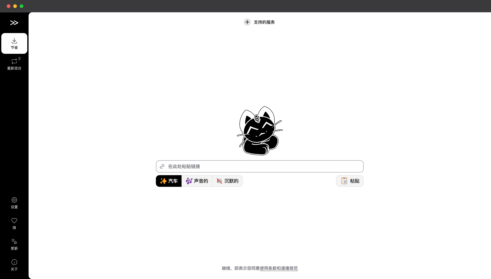

[Cobalt](https://github.com/imputnet/cobalt) 是一个现代化的媒体下载工具，让下载在线内容变得简单而优雅。

## 详细介绍

[Cobalt](https://cobalt.tools) 是一个开源的 [媒体下载](https://site.lovejade.cn/tags/下载) 工具，基于 [Go](https://site.lovejade.cn/post/606aa86a00d67605dca7de5c)、[TypeScript](https://site.lovejade.cn/post/6278fdeaac00ce3f9b11a8ef) 和 [Svelte](https://site.lovejade.cn/post/62a9c2ad90509e23cea772c0) 开发。它具有以下特点：

- 🚀 简单易用，只需粘贴链接即可下载；
- 🎯 支持多个主流平台，包括 YouTube、Twitter、TikTok 等；
- 🔒 注重隐私，无广告、无跟踪器；
- ⚡️ 高效快速的下载体验；
- 🎨 现代化的用户界面；
- 🌐 支持自托管部署；
- 📱 支持移动端访问；
- 🔄 支持批量下载；
- 🎵 支持音频提取；

Cobalt 的设计理念是让媒体下载变得简单而不烦恼。无需安装复杂的软件，无需忍受恼人的广告，只需：

1. **访问网站**：打开 Cobalt 网页；
2. **粘贴链接**：将要下载的媒体链接粘贴到输入框；
3. **选择格式**：选择想要的下载格式和质量；
4. **开始下载**：点击下载按钮即可；

## 效果截图



## 在线体验

您可以访问 [Cobalt 官方实例](https://cobalt.tools) 来体验其功能。

## 快捷部署

新建 `docker-compose.yaml` 文件，并作如下配置，具体参见文章 [如何运行钴实例](https://github.com/imputnet/cobalt/blob/main/docs/run-an-instance.md)：

```docker
services:
    cobalt-api:
        image: ghcr.io/imputnet/cobalt:10

        init: true
        read_only: true
        restart: unless-stopped
        container_name: cobalt-api

        ports:
            - 9000:9000/tcp
            # if you use a reverse proxy (such as nginx),
            # uncomment the next line and remove the one above (9000:9000/tcp):
            # - 127.0.0.1:9000:9000

        environment:
            # replace https://api.url.example/ with your instance's url
            # or else tunneling functionality won't work properly
            API_URL: "https://api.url.example/"

            # if you want to use cookies for fetching data from services,
            # uncomment the next line & volumes section
            # COOKIE_PATH: "/cookies.json"

            # it's recommended to configure bot protection or api keys if the instance is public,
            # see /docs/protect-an-instance.md for more info

            # see /docs/run-an-instance.md for more variables that you can use here

        labels:
            - com.centurylinklabs.watchtower.scope=cobalt

        # uncomment only if you use the COOKIE_PATH variable
        # volumes:
            # - ./cookies.json:/cookies.json

    # watchtower updates the cobalt image automatically
    watchtower:
        image: ghcr.io/containrrr/watchtower
        restart: unless-stopped
        command: --cleanup --scope cobalt --interval 900 --include-restarting
        volumes:
            - /var/run/docker.sock:/var/run/docker.sock
```

根据您的需要进行编辑。确保用您自己的 URL 替换默认 URL，否则钴将无法正常工作；之后运行如下命令即可：

```bash
docker compose up -d
```

如果您希望您的实例支持需要身份验证才能查看公共内容的服务，请 `cookies.json` 在与 相同的目录中创建文件 docker-compose.yml。示例 cookies 文件[可在此处找到](https://github.com/imputnet/cobalt/blob/main/docs/examples/cookies.example.json)。