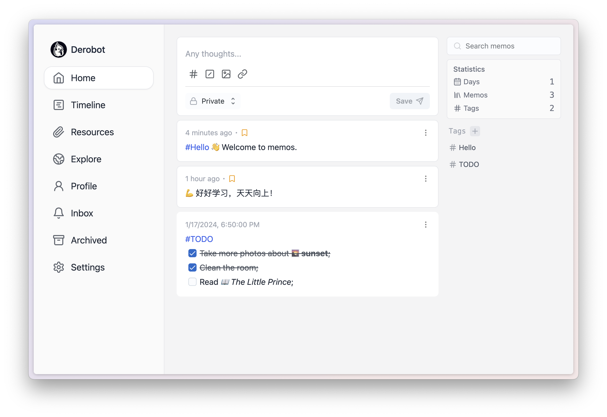

[Memos](https://github.com/usememos/memos) 开源、轻量级笔记服务。轻松捕捉并分享您的精彩想法。

## 详细介绍

[Memos](https://site.lovejade.cn/redirect?url=https://usememos.com/) ，具有 [知识管理](https://site.lovejade.cn/tags/知识管理) 和 [协作](https://site.lovejade.cn/tags/协作) 功能的开源**自托管**备忘录中心；基于 [Go](https://site.lovejade.cn/post/606aa86a00d67605dca7de5c) 、TypeScript、 [React](https://site.lovejade.cn/post/5b1294b5e93ed2618cfac134) 、Less、 [Tailwind CSS](https://site.lovejade.cn/post/5fd20cb4c06d6302c1907ec7) HTML 等编写；该团队在 Github 上有介绍到它具备以下功能：

- 🦄 开源并永久免费。
- 🚀 支持在几秒钟内用 Docker、docker-compose 进行自我托管。
- 📜 首先是普通文本区，并支持一些有用的 markdown 语法。
- 👥 协作并与你的队友分享。
- 🧑💻 用于自助服务的 RESTful API。

仅简单这么介绍，在笔者看来并不完备。在笔者看来，[Memos](https://github.com/usememos/memos) 是理想中的「随笔/知识管理工具/个人微博」应用。主要因为以下几点：设计简洁、打开即写（类推特）；支持**自托管**，且操作方便；满足**个性化定制**设置；良好的内置搜索体验；可开启其他人注册 ®️；拥有类 Github Contribution 格子记录 📝；支持创建快捷方式（Filter Shortcut，即根据标签、文本、展示时间等创建的过滤规则）......虽然存在些待优化点，如暂不支持设置标题（Title）、图标（ICON） 以及评论，注入 GA 统计需要额外编写 loadScript 函数，页面直出是 SPA 等，但瑕不掩瑜，Memos 已然成为业余文字阵地的新宠（已于 2022 年 11 月 22 日晚，迫不及待搭建了 [半缘修道舫](https://memo.lovejade.cn/) ，感兴趣朋友可前往以查看效果）。如果您也有欲构建属于个人的微博或知识管理工具，Memos 值得考虑。

## 效果截图



## 在线体验

[半缘修道观](https://memo.lovejade.cn/)：基于 Memos 所搭建的个人微博、知识管理系统、备忘录；用以记载平时阅读、随笔、感悟，以及与 ChatGPT 对话等内容。该名取自元稹诗句：“取次花丛懒回顾，半缘修道半缘君”。

## 快捷部署

新建 `docker-compose.yaml` 文件，并作如下配置：

```docker
version: "3.0"
services:
  memos:
    image: neosmemo/memos:0.20.0
    container_name: memos
    volumes:
      - ./memos/:/var/opt/memos
    ports:
      - 5230:5230
```

在终端执行 `docker-compose up -d` 命令即可部署；如果您想升级至更高版本，可运行如下命令：

```bash
docker-compose down && docker image rm neosmemo/memos:0.20.0 && docker-compose up -d
```