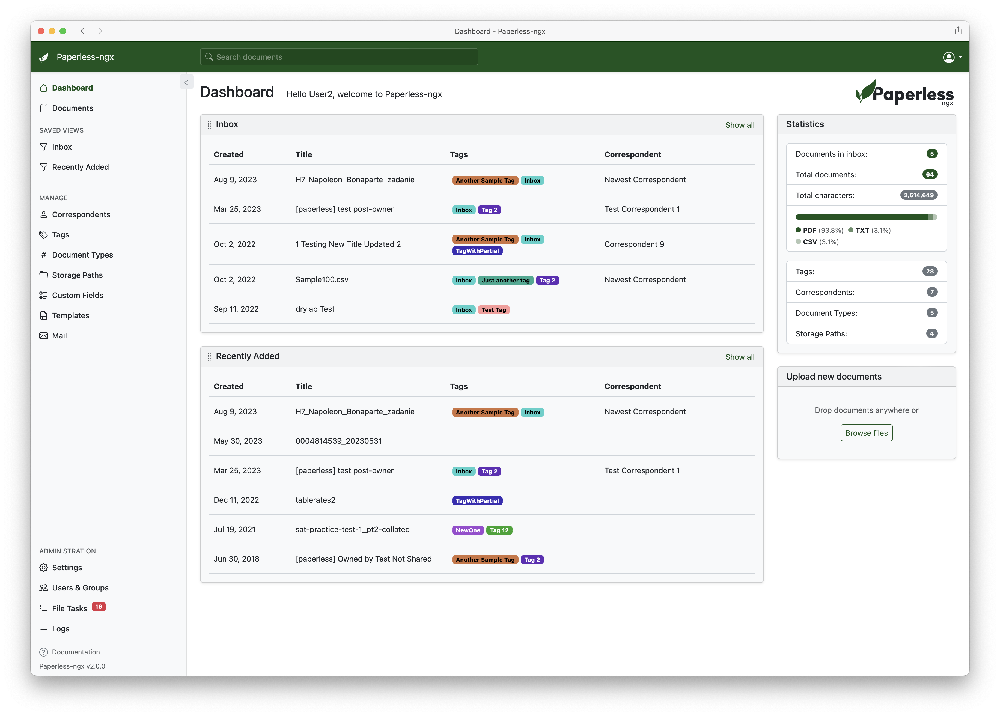

[Paperless-ngx](https://docs.paperless-ngx.com/) 是一个社区支持的开源文档管理系统，可将您的物理文档转换为可搜索的在线档案，这样您就可以减少纸张的使用。

## 详细介绍

Paperless-ngx 具有如下功能特征：

- 使用标签、通讯员、类型等**组织和索引扫描的文档。**
- 对文档执行**OCR ，添加可搜索和可选择的文本，甚至可以对仅使用图像扫描的文档进行添加。**
- 利用开源 Tesseract 引擎识别 100 多种语言。
- 文档保存为 PDF/A 格式，专为长期存储而设计，与未更改的原件一起保存。
- 使用机器学习自动向您的文档添加标签、通讯员和文档类型。
- 支持 PDF 文档、图像、纯文本文件、Office 文档（Word、Excel、Powerpoint 和 LibreOffice 等效项）及更多。
- 无纸化将您的文档直接存储在磁盘上。文件名和文件夹采用无纸化管理，其格式可以自由配置，不同的文档分配不同的配置。
- **美观、现代的 Web 应用程序**，具有以下特点：
    - 带有统计信息的可定制仪表板。
    - 按标签、通讯员、类型等进行过滤。
    - 批量编辑标签、通讯员、类型等。
    - 在整个应用程序中拖放上传文档。
    - 可自定义的视图可以保存并显示在仪表板和/或侧边栏上。
    - 支持各种数据类型的自定义字段。
    - 可共享的公共链接，可选择过期时间。
- **全文搜索**可帮助您找到所需内容：
    - 自动完成会建议文档中的相关单词。
    - 结果按与您的搜索查询的相关性排序。
    - 突出显示可以显示文档的哪些部分与查询匹配。
    - 搜索类似文档（“更多类似内容”）
- **电子邮件处理**：从您的电子邮件帐户导入文档：
    - 配置多个帐户并为每个帐户配置规则。
    - 处理后，无纸化可以对消息执行标记为已读、删除等操作。
- 内置强大的**多用户权限**系统，支持“全局”权限以及每个文档或对象的权限。
- 强大的模板系统，使您可以更好地控制消费管道。
- **针对多核系统进行了优化**：Paperless-ngx 并行使用多个文档。
- 集成的完整性检查器可确保您的文档存档状况良好。

除此之外，Paperless-ngx 也支持深色模式、通过广泛的过滤机制快速查找文档、并排编辑文档、自定义字段、移动设备等等；它是原始 [Paperless](https://github.com/the-paperless-project/paperless) 和 [Paperless-ng](https://github.com/jonaswinkler/paperless-ng) 项目的正式继承者，旨在将推进和支持该项目的责任分配给一组人员；值得一提的是，Paperless-ngx 许多不同的扫描仪和扫描工具兼容，而且能够基于 [Docker 自部署](https://hub.docker.com/r/paperlessngx/paperless-ngx) 从而保证隐私安全。如果您对该项目感兴趣，可移步至 [Paperless-ngx 在 Github 的开源仓库](https://docs.paperless-ngx.com/) 从而了解更多。

## 效果截图



## 在线体验

[Paperless-ngx 在线 Demo](https://demo.paperless-ngx.com/)。

## 快捷部署

Paperless-ngx 提供交互式安装脚本。该脚本将要求您提供几个配置选项，下载并创建必要的配置文件，拉取 docker 映像，启动无纸化并创建您的用户帐户。该脚本本质上自动执行 Docker 设置中描述的所有步骤。

1. 确保已安装 Docker 和 Docker Compose。

:::tip[提示]
请参阅 https://docs.docker.com/engine/install/ 上的 Docker 安装说明。
:::

2. 下载并运行安装脚本：

```bash
bash -c "$(curl --location --silent --show-error https://raw.githubusercontent.com/paperless-ngx/paperless-ngx/main/install-paperless-ngx.sh)"
```

更多安装方式，请参阅 [Paperless-ngx Install Document](https://docs.paperless-ngx.com/setup/#installation)。