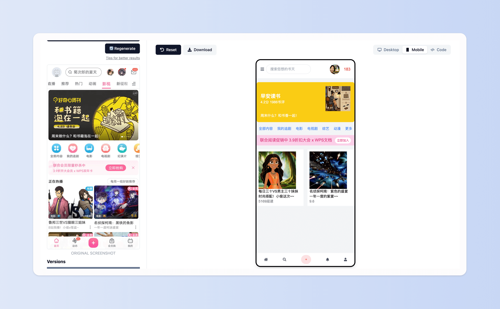

[Screenshot To Code](https://github.com/abi/screenshot-to-code)：一个简单的工具，可使用 AI 将屏幕截图、模型和 Figma 设计转换为干净、实用的代码；支持 HTML、CSS 和 React、Vue 和 Tailwind 等技术栈。

## 详细介绍

该应用程序有一个 React/Vite 前端和一个 FastAPI 后端。如果您想使用 Claude Sonnet 或获得实验视频支持，您将需要一个能够访问 GPT-4 Vision API 的 OpenAI API 密钥或一个 Anthropic 密钥。它支持基于 Docker 进行本地部署，操作方便快捷，所生成的代码效果尚可；对于颇为复杂的页面截图，还原质量有待提升。

### 支持的技术栈

- HTML + Tailwind
- React + Tailwind
- Vue + Tailwind
- Bootstrap
- Ionic + Tailwind
- SVG

### 支持的的模型

- GPT-4 Turbo （2024 年 4 月）- 最佳型号
- GPT-4 Vision (2023 年 11 月）- 在某些输入上比 GPT-4 Turbo 更好的好模型
- Claude 3 Sonnet - 对于许多输入来说，速度更快，并且与 GPT-4 视觉相当或更好
- DALL-E 3 用于图像生成的 DALL-E 3

## 效果截图

### 哔哩哔哩

- 原始截图


- 效果截图



- 生成代码


```html
<html>
 <head>
  <title>
   App Interface
  </title>
  <script src="https://cdn.tailwindcss.com">
  </script>
  <link href="https://cdnjs.cloudflare.com/ajax/libs/font-awesome/5.15.3/css/all.min.css" rel="stylesheet"/>
  <style>
   body {
            font-family: 'Arial', sans-serif;
        }
  </style>
 </head>
 <body class="bg-gray-100">
  <div class="max-w-md mx-auto">
   <!-- Header -->
   <div class="bg-white p-4">
    <div class="flex items-center justify-between">
     <div class="flex items-center space-x-2">
      <i class="fas fa-bars text-gray-600">
      </i>
      <input class="border rounded-full py-2 px-4 text-sm w-full" placeholder="搜索您想的书天" type="text"/>
     </div>
     <div class="flex items-center space-x-4">
      
      <div class="text-red-600">
       183
      </div>
     </div>
    </div>
   </div>
   <!-- Main content -->
   <div class="mt-4">
    <!-- Banner -->
    <div class="bg-yellow-400 p-4 rounded-lg text-white">
     <div class="flex justify-between items-center">
      <div>
       <h2 class="font-bold text-xl">
        早安读书
       </h2>
       <p class="text-sm">
        4.2分 1986书评
       </p>
      </div>
      
     </div>
     <p class="mt-2 text-sm">
      周末什么？和书香一起！
     </p>
    </div>
    <!-- Navigation -->
    <div class="flex justify-around text-blue-500 text-sm mt-4">
     <button>
      全部内容
     </button>
     <button>
      我的追剧
     </button>
     <button>
      电影
     </button>
     <button>
      电视剧
     </button>
     <button>
      综艺
     </button>
     <button>
      动漫
     </button>
     <button>
      更多
     </button>
    </div>
    <!-- Notification -->
    <div class="bg-pink-200 text-center p-2 mt-4 text-pink-600">
     <span>
      联合阅读促销中 3.9折扣大会 x WPS文档
     </span>
     <button class="text-xs bg-white rounded-full px-2 py-1 ml-2">
      立即加入
     </button>
    </div>
    <!-- Content cards -->
    <div class="grid grid-cols-2 gap-4 mt-4">
     <div class="bg-white p-2">
      
      <div class="text-sm">
       <h3>
        每日三十VS男主三十妹妹
       </h3>
       <p>
        时尚搭配！小偷这次~~
       </p>
       <span class="text-gray-500">
        5169阅读
       </span>
      </div>
     </div>
     <div class="bg-white p-2">
      
      <div class="text-sm">
       <h3>
        名侦探柯南：紫色的盛宴
       </h3>
       <p>
        一年一度的紫宴~~
       </p>
       <span class="text-gray-500">
        9.6
       </span>
      </div>
     </div>
    </div>
   </div>
   <!-- Footer -->
   <div class="fixed bottom-0 left-0 right-0 bg-white py-2 flex justify-around items-center text-gray-600 text-sm">
    <i class="fas fa-home">
    </i>
    <i class="fas fa-search">
    </i>
    <button class="text-red-500 bg-red-100 rounded-full px-4 py-2">
     +
    </button>
    <i class="fas fa-bell">
    </i>
    <i class="fas fa-user">
    </i>
   </div>
  </div>
 </body>
</html>
```

### 蓝心千询

- 原始截图


- 效果截图


- 生成代码

```html
<html>
 <head>
  <title>
   App Interface
  </title>
  <script src="https://cdn.tailwindcss.com">
  </script>
  <link href="https://cdnjs.cloudflare.com/ajax/libs/font-awesome/5.15.3/css/all.min.css" rel="stylesheet"/>
  <style>
   body {
            font-family: 'Arial', sans-serif;
        }
  </style>
 </head>
 <body class="bg-white">
  <div class="max-w-sm mx-auto">
   <!-- Header -->
   <div class="text-center p-4 bg-blue-500 text-white">
    <h1 class="text-xl font-bold">
     探索
    </h1>
   </div>
   <!-- Banner -->
   <div class="mt-4 p-4 bg-blue-200 rounded-lg shadow">
    <div class="flex justify-between items-center">
     <div>
      <p class="text-blue-800 font-semibold">
       激心千语
      </p>
      <p class="text-xs text-blue-700">
       AIGC创新赛 技能创作平台
      </p>
      <p class="text-xs text-blue-700">
       2024中国高校计算机大赛
      </p>
     </div>
     
    </div>
    <button class="mt-2 bg-blue-600 text-white rounded py-1 px-2 text-xs">
     了解赛事详情
    </button>
   </div>
   <!-- News Section -->
   <div class="mt-4">
    <div class="px-4 py-2 flex items-center justify-between">
     <h2 class="text-lg font-semibold">
      全部动态
     </h2>
     <i class="fas fa-ellipsis-h text-gray-400">
     </i>
    </div>
    <div class="px-4">
     <!-- News Item 1 -->
     <div class="flex items-center py-2">
      
      <div class="ml-4">
       <p class="text-sm">
        壮志未酬
       </p>
       <p class="text-xs text-gray-500">
        壮志未酬是一位热爱壮志设计的专业师傅，你想要的壮志，她都会~
       </p>
      </div>
      <span class="ml-auto bg-yellow-200 text-yellow-800 text-xs py-1 px-2 rounded-full">
       4.1万
      </span>
     </div>
     <!-- News Item 2 -->
     <div class="flex items-center py-2">
      
      <div class="ml-4">
       <p class="text-sm">
        秋林
       </p>
       <p class="text-xs text-gray-500">
        一个喜欢你阅读、旅行、美食，喜欢人高的女心理相~
       </p>
      </div>
      <span class="ml-auto bg-yellow-200 text-yellow-800 text-xs py-1 px-2 rounded-full">
       4.4万
      </span>
     </div>
     <!-- News Item 3 -->
     <div class="flex items-center py-2">
      
      <div class="ml-4">
       <p class="text-sm">
        恋爱军师-卡斯特
       </p>
       <p class="text-xs text-gray-500">
        卡斯特是恋爱军师，你的阅读他提供最佳恋爱指导！
       </p>
      </div>
      <span class="ml-auto bg-yellow-200 text-yellow-800 text-xs py-1 px-2 rounded-full">
       4.1万
      </span>
     </div>
     <!-- News Item 4 -->
     <div class="flex items-center py-2">
      
      <div class="ml-4">
       <p class="text-sm">
        Fmoii播放点活
       </p>
       <p class="text-xs text-gray-500">
       </p>
      </div>
      <span class="ml-auto bg-yellow-200 text-yellow-800 text-xs py-1 px-2 rounded-full">
       8591
      </span>
     </div>
    </div>
   </div>
   <!-- Footer -->
   <div class="mt-4 flex justify-between items-center px-4 py-2 bg-gray-100">
    <i class="fas fa-home text-gray-600">
    </i>
    <i class="fas fa-search text-gray-600">
    </i>
    <i class="fas fa-user text-gray-600">
    </i>
   </div>
  </div>
 </body>
</html>
```

## 快捷部署

```bash
git clone  https://github.com/abi/screenshot-to-code.git
cd screenshot-to-code
echo "OPENAI_API_KEY=sk-your-key" > .env
docker-compose up -d --build
```
