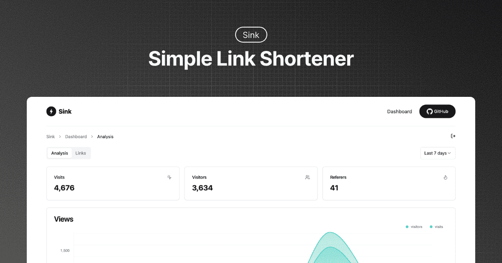

[Sink](https://github.com/ccbikai/sink) 一个简单/快速/安全的链接缩短器，具有分析功能，100% 在 Cloudflare 上运行。

## 详细介绍

[Memos](https://github.com/ccbikai/sink)，一个简单/快速/安全的链接缩短器，具有分析功能，100% 在 Cloudflare 上运行。该团队在 Github 上有介绍到它具备以下功能：

- **URL 缩短**：将您的 URL 压缩到最短长度。
- **分析**：监控链接分析并收集有见地的统计数据。
- **无服务器**：无需传统服务器即可部署。
- **可定制的 Slug**：支持个性化 Slug。
- **🪄 AI Slug**：利用 AI 生成 slug。
- **链接到期**：设置链接的到期日期。

## 效果截图

## 在线体验

[Sink 链接缩短器](https://sink.niceshare.site/?ref=niceshare.site)：基于 Sink 搭建的简单/快速/安全的链接缩短器，具有分析功能，100% 在 Cloudflare 上运行。

## 快捷部署

1. 将存储库[分叉到您的 GitHub 帐户](https://github.com/ccbikai/Sink/fork)。
2. 创建[Cloudflare Pages](https://developers.cloudflare.com/pages/)项目。
3. 选择`Sink`存储库和`Nuxt.js`预设。
4. 配置环境变量。
   1. `NUXT_SITE_TOKEN`长度必须超过**8**。
   2. `NUXT_CF_ACCOUNT_ID` [找到您的帐户 ID](https://developers.cloudflare.com/fundamentals/setup/find-account-and-zone-ids/)。
   3. `NUXT_CF_API_TOKEN`创建[Cloudflare API 令牌](https://developers.cloudflare.com/fundamentals/api/get-started/create-token/)。此令牌`Account.Account Analytics`至少需要权限。[参考](https://developers.cloudflare.com/analytics/analytics-engine/sql-api/#authentication)。
5. 保存并部署。
6. 取消部署，导航至`Settings`-> `Functions`。
   1. KV 命名空间绑定。将变量名称绑定`KV`到 KV 命名空间。
   2. 工人 AI 绑定。将变量名称绑定`AI`到工人 AI 目录。_可选_
   3. 分析引擎绑定。将变量名称绑定`ANALYTICS`到`sink`数据集，并为您的帐户启用[Cloudflare 分析引擎测试版。](https://developers.cloudflare.com/analytics/analytics-engine/get-started/)
7. 重新部署。
